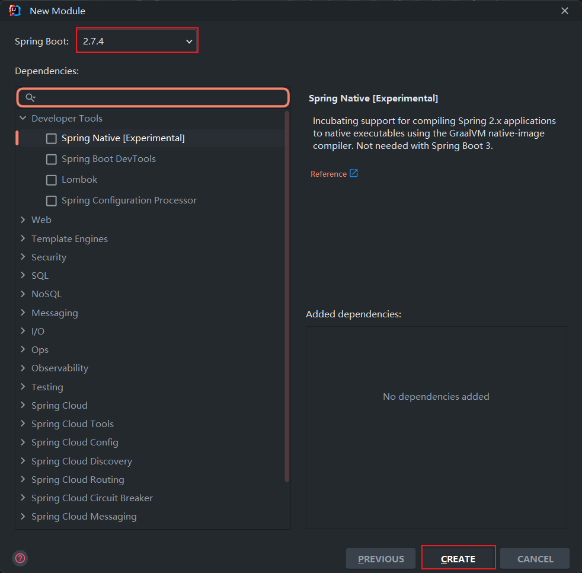

# spring-boot-hello

## 简述

该模块展示如何创建一个 Spring Boot 项目，页面输出 "hello, world"。

## 创建项目

右键点击项目名称，"New"->"Module"，填写项目信息，并选择项目位置、构建方式和 JDK 版本，点击 "NEXT"。


选择 Spring 版本和需要的依赖（如 Lombok），也可以后续在 pom.xml 文件中添加，点击 "CREATE"。此时，就成功创建了一个 Spring Boot
项目。


## 代码

### pom.xml

```xml
<?xml version="1.0" encoding="UTF-8"?>
<project xmlns="http://maven.apache.org/POM/4.0.0" xmlns:xsi="http://www.w3.org/2001/XMLSchema-instance"
         xsi:schemaLocation="http://maven.apache.org/POM/4.0.0 https://maven.apache.org/xsd/maven-4.0.0.xsd">
    <modelVersion>4.0.0</modelVersion>

    <parent>
        <groupId>org.springframework.boot</groupId>
        <artifactId>spring-boot-starter-parent</artifactId>
        <version>2.7.4</version>
    </parent>

    <groupId>com.xybert</groupId>
    <artifactId>spring-boot-hello</artifactId>
    <version>0.0.1-SNAPSHOT</version>
    <name>spring-boot-hello</name>
    <description>spring-boot-hello</description>

    <properties>
        <java.version>1.8</java.version>
    </properties>

    <dependencies>
        <dependency>
            <groupId>org.springframework.boot</groupId>
            <artifactId>spring-boot-starter</artifactId>
        </dependency>

        <dependency>
            <groupId>org.springframework.boot</groupId>
            <artifactId>spring-boot-starter-web</artifactId>
        </dependency>

        <dependency>
            <groupId>org.springframework.boot</groupId>
            <artifactId>spring-boot-starter-test</artifactId>
            <scope>test</scope>
        </dependency>

        <!-- commons-lang工具类库 -->
        <dependency>
            <groupId>commons-lang</groupId>
            <artifactId>commons-lang</artifactId>
            <version>2.6</version>
        </dependency>
    </dependencies>

    <build>
        <plugins>
            <plugin>
                <groupId>org.springframework.boot</groupId>
                <artifactId>spring-boot-maven-plugin</artifactId>
            </plugin>
        </plugins>
    </build>

</project>
```

### application.yml

```yaml
server:
  port: 9001
  servlet:
    context-path: /springboot/practice
```

### SpringBootHelloApplication.class

```java
package com.xybert.springboothello;

import org.springframework.boot.SpringApplication;
import org.springframework.boot.autoconfigure.SpringBootApplication;

/**
 * @author xybert
 * @date 2022/10/17 16:32
 */
@SpringBootApplication
public class SpringBootHelloApplication {

    public static void main(String[] args) {
        SpringApplication.run(SpringBootHelloApplication.class, args);
    }

}
```

### HelloWorld.class

```java
package com.xybert.springboothello;

import org.apache.commons.lang.StringUtils;
import org.springframework.web.bind.annotation.GetMapping;
import org.springframework.web.bind.annotation.RequestMapping;
import org.springframework.web.bind.annotation.RequestParam;
import org.springframework.web.bind.annotation.RestController;

/**
 * @author xybert
 * @date 2022/10/17 16:33
 */

@RestController
@RequestMapping("/hello")
public class HelloWorld {

    private final static String HELLO = "Hello";

    @GetMapping("")
    public String helloWorld(@RequestParam(name = "object", required = false) String object) {
        if (StringUtils.isBlank(object)) {
            object = "world";
        }
        return String.format("%s, %s", HELLO, object);
    }
}
```
